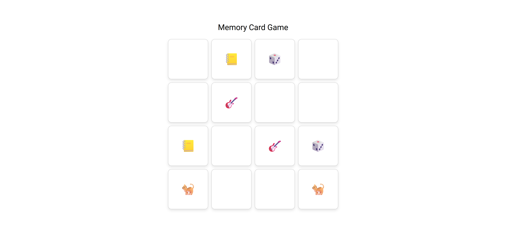

# Memory Card Game

Basic memory card game (with 8 pairs) built with Angular.



## Installation
1. Clone this repository:
    ```sh
    git clone https://github.com/sixthnovember/MemoryCardGame.git
    cd MemoryCardGame/memory-card-game
    ```
2. Run the game:
    ```sh
    ng serve
    ```
3. Open your browser and navigate to http://localhost:4200.